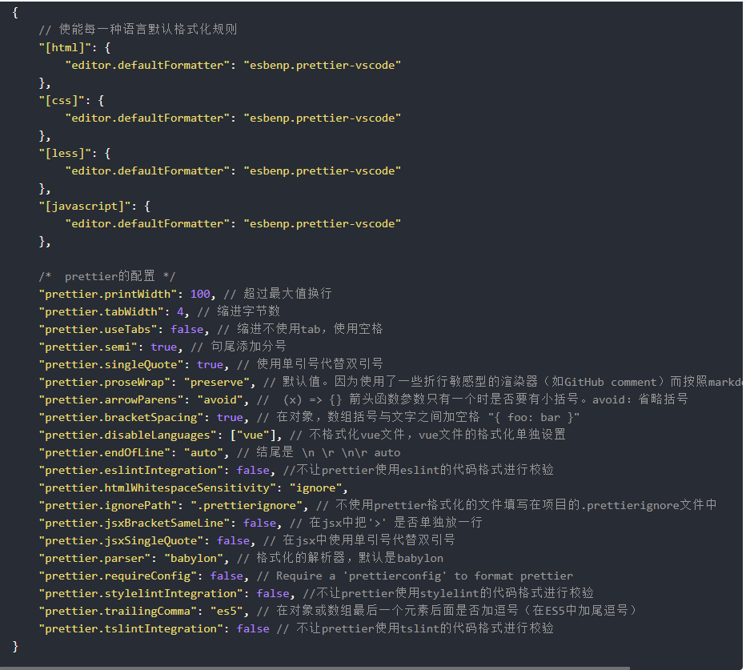
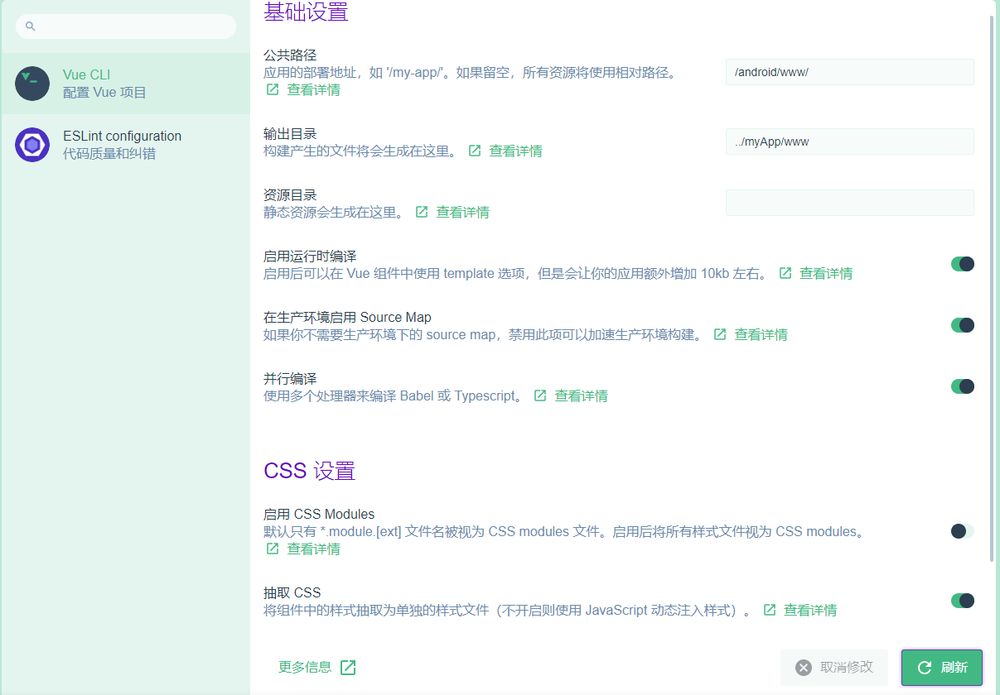
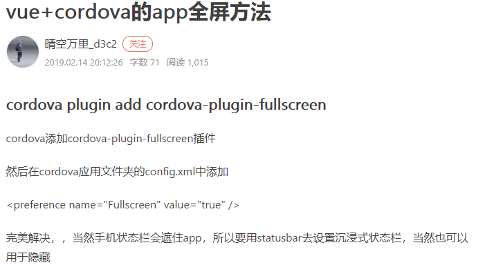
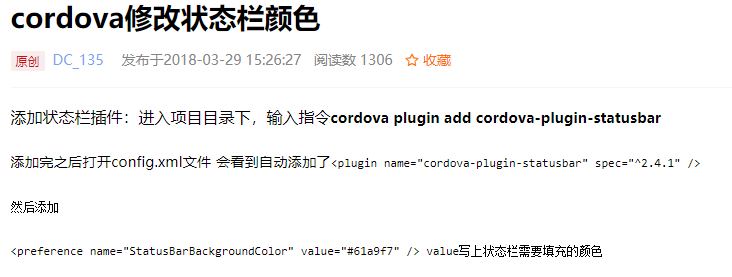
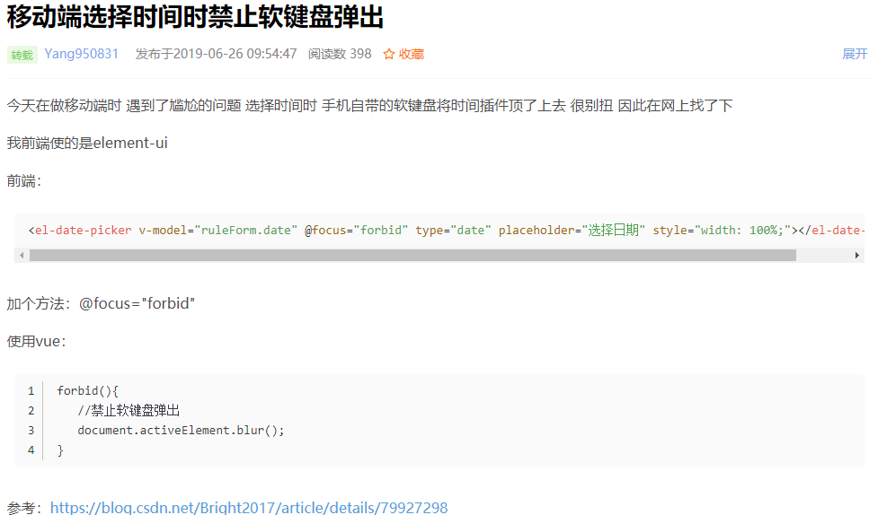
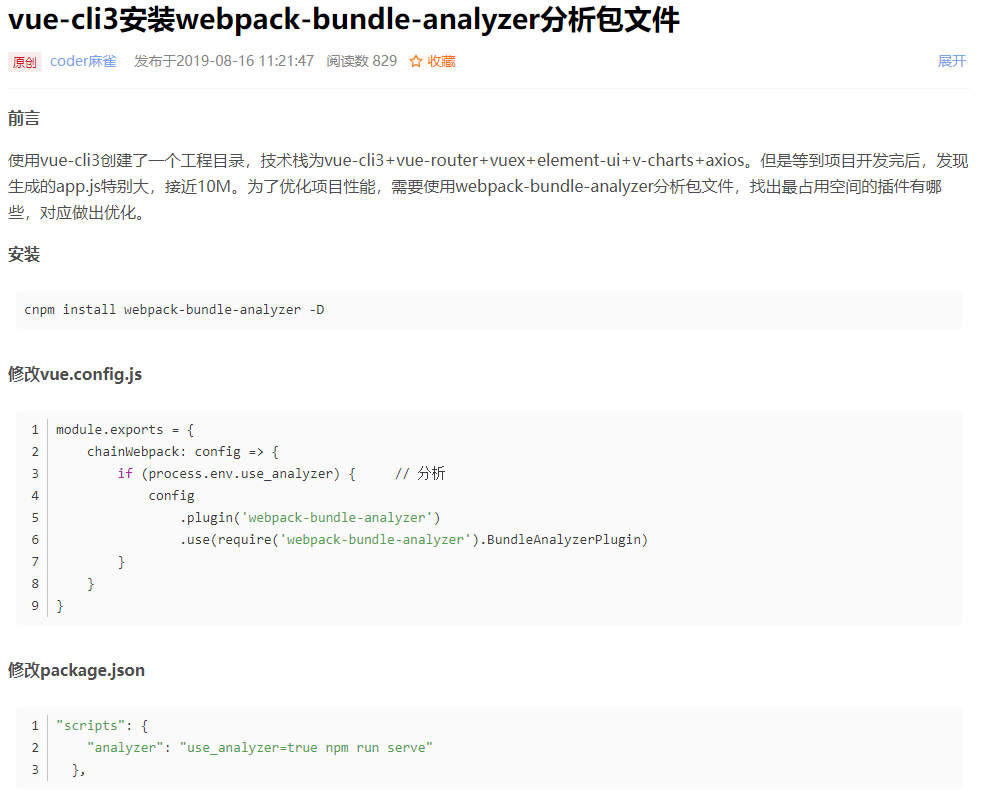
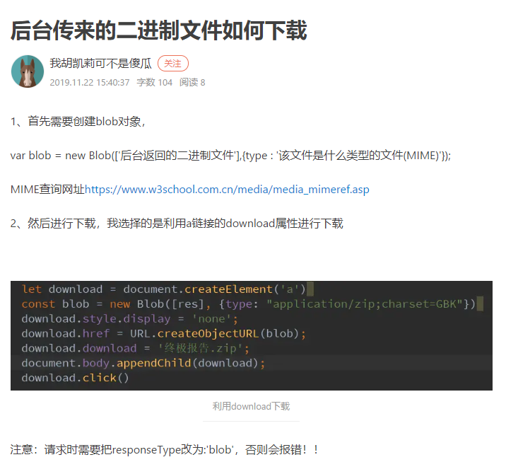
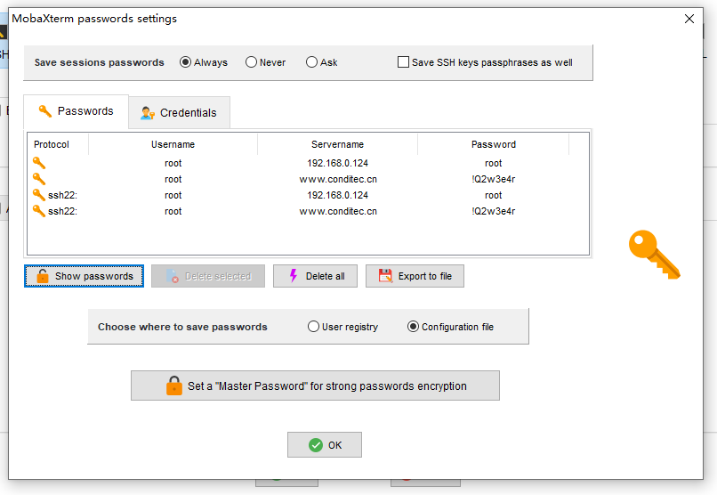

1.树形组件

- Treeselect组件：
  
- vue-treeselect是一个基于vue框架实现的一个下拉属性结构组件
  
- `:props="treeSettings"`属性设置label状态

- ```js
  treeSettings: {
  label: function (data) {
   return data.categoryName + '( T : ' + data.weight + ' )'
  },
   children: 'children'
  }
  ```
  

2.解决组件缓存，不能及时绑定最新状态

- **方案一**

  当数据变更后,通过`watch` 监听，先去销毁当前的组件，然后再重现渲染。使用 `v-if` 可以解决这个问题

- **方案二**

  通过vue `key` 实现，原理[官方文档](https://cn.vuejs.org/v2/guide/list.html#key)。所以当key 值变更时，会自动的重新渲染。

[参考文档](https://blog.csdn.net/zyx1303031629/article/details/86656785)

3.可视化接口管理平台

- YApi
- [官网地址](http://yapi.demo.qunar.com/)

4.vue-treselect组件

- [官网地址](https://vue-treeselect.js.org/)

5.原型创建工具

- [磨刀](https://org.modao.cc/)

6.配置vscode语法检查自动排版

- 再vscode中设置——命令面板——setting.json

```json
{
  "workbench.editor.enablePreview": false, //打开文件不覆盖
  "search.followSymlinks": false, //关闭rg.exe进程
  "editor.minimap.enabled": false, //关闭快速预览
  "files.autoSave": "off", //关闭自动保存，可以自己开启
  "editor.lineNumbers": "on", //开启行数提示
  "editor.quickSuggestions": {
    //开启自动显示建议
    "other": true,
    "comments": true,
    "strings": true
  },
  "editor.tabSize": 2, //制表符符号eslint
  "editor.formatOnSave": true, //每次保存自动格式化
  "eslint.autoFixOnSave": true, // 每次保存的时候将代码按eslint格式进行修复
  "prettier.eslintIntegration": true, //让prettier使用eslint的代码格式进行校验
  "prettier.semi": false, //去掉代码结尾的分号
  "prettier.singleQuote": true, //使用单引号替代双引号
  "javascript.format.insertSpaceBeforeFunctionParenthesis": true, //让函数(名)和后面的括号之间加个空格
  "vetur.format.defaultFormatter.html": "js-beautify-html", //格式化.vue中html
  "vetur.format.defaultFormatter.js": "vscode-typescript", //让vue中的js按编辑器自带的ts格式进行格式化
  "vetur.format.defaultFormatterOptions": {
    "js-beautify-html": {
      "wrap_attributes": "force-aligned" //属性强制折行对齐
    }
  },
  "eslint.validate": [
    //开启对.vue文件中错误的检查
    "javascript",
    "javascriptreact",
    {
      "language": "html",
      "autoFix": true
    },
    {
      "language": "vue",
      "autoFix": true
    }
  ]
}
```

- 安装需要的vscode插件

7.基于D2 Admin权限管理

[参考文档](https://www.jianshu.com/p/b1453aaa4294)

8.axios请求传参

- params——请求头里面带的参数
- data——请求体里面带的参数

9.table组件导出表格和打印

- [表格导出和打印](https://www.cnblogs.com/kaidarwang/p/9449815.html)

10.vue中svg的使用

- [svg使用](https://www.cnblogs.com/Jiangchuanwei/p/9386792.html)

11.控制table表格中多选框是否可选

- | selectable | 仅对 type=selection 的列有效，类型为 Function，Function 的返回值用来决定这一行的 CheckBox 是否可以勾选 | Function(row, index) |
  | ---------- | ------------------------------------------------------------ | -------------------- |
  |            |                                                              |                      |

12.飞冰版D2 Admin

[文档介绍](https://juejin.im/post/5b6349716fb9a04f834669d6)

13.Vue.set(object, key, value) 方法将响应属性添加到嵌套的对象上

14.嵌套数据表单验证+自定义校验规则，实现关联表单数据验证

15.同时下载多个git 包

https://www.npmjs.com/package/download-git-repo

16.drag-tree-table 可拖拽 树形表格

https://www.npmjs.com/package/drag-tree-table/v/1.2.1

17.element ui 的表单resetFields()方法 能够置空表单 到初始状态

`this.$refs[formName].resetFields()`

18.align 属性规定 div 元素中的内容的水平对齐方式。

19.鼠标回车事件

如果是原生的input，使用 @keyup.enter就可以，若是使用了element-ui，则要加上native限制符，因为element-ui把input进行了封装，原事件就不起作用了

20.elementUI中input框无法输入的问题

https://blog.csdn.net/hailangtuteng/article/details/96904845

21.align:right;属性

22.element-ui 2.11.1 菜单堆栈溢出bug

23.全局自定义指令实现按钮权限控制

24.树形组件默认选中项

```
this.$nextTick(() => {          
	this.$refs.categoryTree.setCurrentKey(this.selectCategoryId)
})
```

25.UI 框架： vant, vux, vonic； 打包工具：cordova（phonegap）, HbuilderX

- [HbuilderX打包APP](https://www.cnblogs.com/taohuaya/p/10263519.html)

- [cordova打包iOS](https://www.jianshu.com/p/80a69bbdbc8f)

- [cordova打包App](https://www.cnblogs.com/w-wanglei/p/5565305.html)

26.`async/await`使用

- https://www.jianshu.com/p/73b070eebf50

27.使用`dotenv`插件加载`.env`文件

- https://cloud.tencent.com/developer/ask/132884


- [react中使用dotenv](https://www.jianshu.com/p/76c58646c3ec)

28、使用require.context简化模块引入

- https://www.jianshu.com/p/c894ea00dfec

29、icon使用

- https://juejin.im/post/59bb864b5188257e7a427c09

30、163邮箱

- 账号：lw3080611052
- 密码：lw6989661

31、npm账号

- 用户名：npmlw163
- 密码：liwei6989661

32、路由params传参

- 需要在注册路由的地方给路由加上name参数

```javascript
const router = new VueRouter({
    routes:[{
        ...
    },{
        path:'/payType',
        name:'inputComp',
        component: payType
    }]
})
this.$router.push({
    path: '/payType',
    name: 'inputComp',
    params:{//一定要设置name，才可以传params
        cartList: this.cartList,
        totalMoney:this.totalMoney
    }
});
```

- params传参持久化，在定义路由的时候，给path设定参数

```javascript
export default [{
  path: '/platform',
  component: Layout2,
  children: [{
    path: '/adminCun/:jum',        //这里值用:加参数的写法，jum即为参数，注意一定要用/隔开(多参数传递如上代码↑)
    name:'platformRecycleAdminCun',
    meta:{
      title:'管辖村级详情'
    },
    component: resolve => require(['@/view/platform/recycle/admincun'],resolve)
  }]
}]

path: '/adminCun/:jum/:id/:type

<template slot-scope="props">
  <el-button type="text" @click="$router.push({name:'platformRecycleAdminCun',params:{jum:props.row.jgNum}})">
    {{ props.row.jgName }}
  </el-button>
</template>
```

33、v-if表单校验

- https://www.cnblogs.com/teamblog/p/9566415.html 原理

- https://blog.csdn.net/win7583362/article/details/85157202 解决方案

34、vue中使用富文本编辑器

- https://www.jianshu.com/p/d0c1884505f1
- https://blog.csdn.net/w390058785/article/details/83210948

- html模板引擎https://blog.csdn.net/weixin_39680839/article/details/83992661

35、vue render函数

- https://baijiahao.baidu.com/s?id=1603797081408586727&wfr=spider&for=pc

```javascript
<script>
export default {
  props: {
    type: {
      type: String,
      default: 'normal'
    },
    text: {
      type: String,
      default: ''
    },
    color: {
      type: String,
      default: ''
    },
    icon: {
      type: String,
      default: ''
    }
  },
  render (h) {
    return h('el-button', {
      // 样式
      style: {
        color: this.color
      },
      // 属性
      attrs: {},
      // 组件props
      props: {
        size: 'mini',
        type: 'success',
        plain: true,
        icon: 'el-icon-edit'
      },
      // dom属性
      domProps: {
        innerText: this.text || ''
      },
      // 事件
      on: {
        click: this.handleClick
      }
    })
  },
  methods: {
    handleClick () {
      this.$emit('btnClick')
    }
  }
}
</script>
```

36、vue中打印

- https://www.cnblogs.com/steamed-twisted-roll/p/10683680.html

- https://www.cnblogs.com/dhpong/p/10500370.html
- https://segmentfault.com/q/1010000011527757
- https://www.jianshu.com/p/c5363ddf7d43

37、vue地址栏传值

- https://blog.csdn.net/weixin_39856066/article/details/82107933

```javascript
// query传参: 
this.$router.push({
        path:'/xxx',
        query:{id:id}
      })  
// 接收参数:
this.$route.query.id

// params传参: 
this.$router.push({
        name:'xxx',
        params:{id:id}
      })  
// 接收参数:
this.$route.params.id
```

38、获取屏幕宽度

```javascript
mounted(){
        const that = this
        window.onresize = () => {
          return (() => {
            window.screenWidth = document.body.clientWidth
            that.screenWidth = window.screenWidth
          })()
        }
      }
```

39、图片下载

https://www.cnblogs.com/qq364735538/p/9920621.html

```javascript
downs() {
  var alink = document.createElement("a");
  alink.href = this.shop.shoppic_url;
  alink.download = "pic"; //图片名
  alink.click();
}
```

前端文件下载的几种方式：https://blog.csdn.net/mobile18611667978/article/details/88988884

40、app开发框架

http://cordova.axuer.com/docs/zh-cn/latest/guide/cli/index.html#

41、cordova基本使用

https://www.liangzl.com/get-article-detail-127800.html

https://www.jianshu.com/p/2e9bebb73d37

42、cordova常用插件

https://www.jianshu.com/p/642c9be55446

43、Element树形组件选中回显

https://my.oschina.net/gmarshal/blog/1843526

44、chrome debugger详解

https://blog.csdn.net/qq_27056805/article/details/86413051

45、js合并table单元格

https://www.cnblogs.com/qlqwjy/p/9048317.html

- element ui 单元格合并

```javascript
	getSpanArr (data, col) {
    for (var i = 0; i < data.length; i++) {
      if (i === 0) {
        this[col + 'Arr'].push(1)
        this.pos = 0
      } else {
        // 判断当前元素与上一个元素是否相同
        if (data[i][col] === data[i - 1][col]) {
          this[col + 'Arr'][this.pos] += 1
          this[col + 'Arr'].push(0)
        } else {
          this[col + 'Arr'].push(1)
          this.pos = i
        }
      }
    }
  },
  objectSpanMethod ({ row, column, rowIndex, columnIndex }) {
      if (columnIndex === 0) {
        const _row = this.typeArr[rowIndex]
        const _col = _row > 0 ? 1 : 0
        return {
          rowspan: _row,
          colspan: _col
        }
      } else if (columnIndex === 1) {
        const _row = this.subjectArr[rowIndex]
        const _col = _row > 0 ? 1 : 0
        return {
          rowspan: _row,
          colspan: _col
        }
      }
  }
```

46、.env设置全局环境变量

https://blog.csdn.net/w405722907/article/details/94720868

47、vant引入iconfont图标

https://blog.csdn.net/qq_41672008/article/details/91039273

78、cordova App网页调试

- 为了方便（不需要每次打包都发送apk到手机上），可以通过`cordova serve android`来启动服务，用户可以通过`http://localhost:8000/android/www/index.html`来请求android平台下的页面，也就是相当于手机访问到的首页，如此一来方便调试了。

79、prettier 格式化规则



- 代码风格检查：https://www.jianshu.com/p/2df36e8fe886

80、手机App配置




- 最终配置

```json
module.exports = {
  runtimeCompiler: true,
  outputDir: '../myApp/www',
  assetsDir: '',
  css: {
    sourceMap: true
  },
  publicPath: '/android_asset/www/'
}
```

81、css多行文字超出隐藏

https://www.cnblogs.com/leiting/p/10758389.html

82、cordova打包全面屏





83、cordova插件大全

https://blog.csdn.net/github_39500961/article/details/76270299

84、移动端禁止键盘弹出

https://blog.csdn.net/Yang950831/article/details/93713696



85、vue项目打包分析

https://blog.csdn.net/maquealone/article/details/99674246



86、vue项目打包优化

https://my.oschina.net/u/3970421/blog/2962656

87、下载后台返回的二进制数据文件

https://www.jianshu.com/p/315a49ec5ea7



```javascript
requsetFile (params, url) {
      axios.get(url, {
        params: params,
        responseType: 'blob',
        headers: {
          Authorization: localStorage.getItem('token')
        }
      }).then(res => {
        let blob = new Blob([res.data], {
          type: 'application/vnd.ms-excel'
        })
        let objectUrl = URL.createObjectURL(blob)
        // window.location.href = objectUrl
        let a = document.createElement('a')
        a.href = objectUrl
        a.download = params.fileName
        a.style.display = 'none'
        document.body.appendChild(a)
        a.click()
        URL.revokeObjectURL(objectUrl) // 释放URL 对象
        document.body.removeChild(a)
      })
    }
```

88、码云登录异常

- 码云IP：212.64.62.174
- 修改文件：C:\Windows\System32\drivers\etc
- 添加内容：212.64.62.174     gitee.com

89、vscode用户代码片段

https://www.jianshu.com/p/1f1132df1def

90、windows子系统 ~ 目录

C:\Users\kdt\AppData\Local\Packages\CanonicalGroupLimited.UbuntuonWindows_79rhkp1fndgsc\LocalState\rootfs\home\liwei

91、公司服务器



